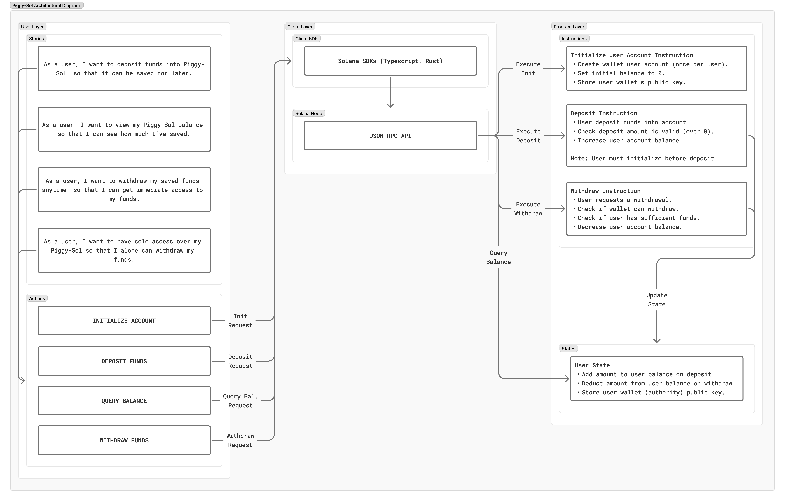

# 🐷 Piggy-Sol

Piggy-Sol is a simple on-chain savings program built on Solana using Anchor. Each user can create their own savings account, deposit SOL into it, and withdraw later — all managed transparently through program logic.

## User Stories
- As a user, I want to deposit funds into Piggy-Sol, so that it can be securely saved on-chain for later.
- As a user, I want to view my Piggy-Sol balance so that I can see how much I've saved.
- As a user, I want to withdraw my saved funds anytime, so that I can get immediate access to my funds.
- As a user, I want to have sole access over my Piggy-Sol so that I alone can withdraw my funds.

## Architectural Diagram



*Architecture showing the three-layer structure: User Layer (stories & actions), Client Layer (SDK & RPC), and Program Layer (instructions, and states).*

## Setup & Usage

> **Prerequisites:** Ensure you're on the Solana localnet environment.

### 1. Clone the repository
```bash
git clone https://github.com/devwraithe/piggy-sol.git
cd piggy-sol
```

### 2. Install dependencies

> ⚠️ **Important:** Don't skip this step — tests won't run without it.
```bash
yarn install
```

### 3. Build the program
```bash
anchor build
```

### 4. Run tests
```bash
anchor test
```

## Features

- **Initialize Account**: Create your personal savings account.
- **Deposit**: Add funds to your savings anytime.
- **Withdraw**: Access your funds whenever needed.
- **Balance Query**: Check your savings balance without transaction fees.

## Security

- Only the wallet that created the account can withdraw funds.
- All operations are verified on-chain through Solana's program logic.